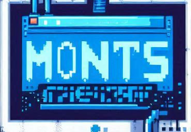

# Documentación de proyectos

## Apartados de la documentación

0. Promoción

    * Nombre de la aplicación

    Montls

    * Descripción en una frase

    App para reparar de manera eficaz y rápida todo tipo de errores del ordenador que tengas

    * Quien soy

    Mi nombre es Josep Vila Nuñez, el creador de esta aplicación que conseguirá arreglar cualquier imprevisto que tengais 

1. Planificación

    * Necesidad de la aplicación

    La necesidad principal es ofrecer una solución veloz y perfecta para solucionar problemas de los ordenadores, y siendo accesible para usuarios de todo tipo de niveles

    * Otras soluciones existentes

    Existen otras herramientas y programas de reparación pero Montls se diferencia por su interfaz intuitiva, su capacidad de diagnóstico preciso y su base de datos actualizada de todas soluciones

    * Principales funcionalidades

    Diagnóstico automático de los problemas
    Reparación con un solo clic
    Optimización del rendimiento del sistema
    Actualización de drivers
    Soporte técnico web

    * Guía de estilo

        * Logo

         

        * Tipografías

        Open Sans (para el cuerpo del texto)
        Montserrat (para los títulos)

        * Iconos

        Font Awesome

        * Layout

        Diseño limpio y moderno con una navegación fácil y sencilla

2. Desarrollo

    * Tecnologías empleadas

        Interfaz gráfica: HTML, CSS, Javascript, PHP
        
    * Pruebas de software

    Se realizan pruebas de integración para asegurar la calidad de codigo
       
    * Descripción del proceso de desarrollo

    Utilizando una interfaz moderna para seguido añadir todas las posibilidades de errores, y después las cientos de soluciones

3. Manual de usuario

    Guía por si es necesaria para aquellos que de igual forma no saben utilizar la aplicación

4. Problemas resueltos

    Rendimiento bajo ahora está cómo anteriormente o incluso mejor, y ahorro de recursos

5. Propuestas de mejora

      Integración con herramientas de diagnóstico de hardware
      Soporte para más sistemas operativos
      Personalización de interfaz

7. Bibliografía

     Documentación de Font Awesome

8. Anexos

 * [Documentación del proyecto en PDF](documentacio.pdf)